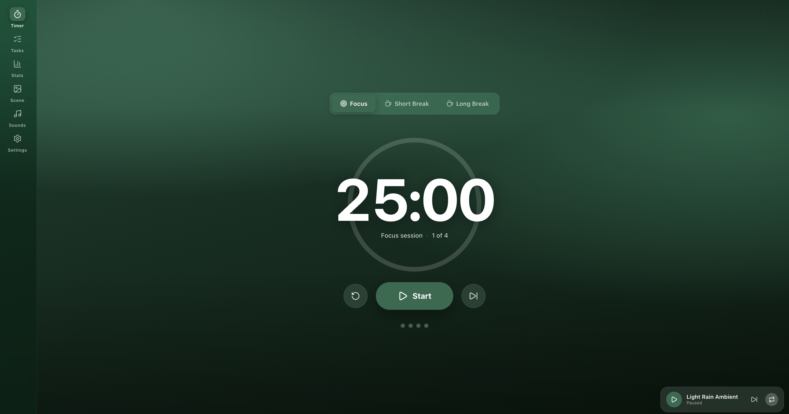

# FocusFlow



FocusFlow is a modern, offline-only desktop Pomodoro timer. It features focus and break cycles, ambient
sounds, custom backgrounds, daily to-dos, statistics, and full-screen break
enforcement. 

FocusFlow is built with Tauri 2, React, and TypeScript. All data is stored
locally; there is no account system and no network dependency.

## Development

```bash
npm install
npm run tauri dev      # run the desktop app
npm run dev            # run just the web UI (no native features)
npm run tauri build    # produce a packaged build
```

## Bundled ambient audio

Bundled tracks live in `public/sounds/` and are sourced from
[Pixabay](https://pixabay.com) under the Pixabay Content License (royalty-free).

| Track | Artist |
|---|---|
| Cosmic Ambient | [Alex Wit](https://pixabay.com/users/light_music-40074088/) |
| Heavenly Energy | [Alex Wit](https://pixabay.com/users/light_music-40074088/) |
| Ambient Occlusion | [Wilson Marumura](https://pixabay.com/users/blackwilson-44944329/) |
| Ambient Background | [Tunetank](https://pixabay.com/users/tunetank-50201703/) |
| Deep Meditation | [Roman Dudchyk](https://pixabay.com/users/grand_project-19033897/) |
| Light Rain Ambient | [Mikhail](https://pixabay.com/users/soundsforyou-4861230/) |

All music/sound effects from Pixabay. Thanks to the artists above.
